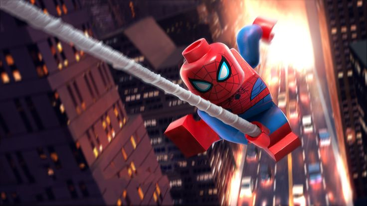

<!-- README.md для профиля Invcxze -->
<h1 align="center">Привет, я <a href="https://github.com/Invcxze">Invcxze</a> 👋</h1>
<h3 align="center">🧩 Backend-разработчик — Django / Python / SQL | ⚛️ React (front-end) | 🎮 Ретро-консоли & комиксы</h3>

  
  
  
  

---

## 🧠 Кратко обо мне
- 💼 **5 лет** коммерческой разработки  
- 🔭 Фокус: бекенд (Django, Python), сложные SQL-запросы и архитектура API  
- ⚛️ Дополнительно: самостоятельно пишу фронтенд на **React / JavaScript**  
- 🎯 Интересы: ретро-консоли, комиксы, LEGO, иногда игры

---

## 🛠 Технологии

  
  
  
  
  
  
  
  

---

## 📊 Статистика

  
  

---

## 🎮 Хобби

  Ниже — мои увлечения.
   

  
  
  

  <em>Коллекционирую ретро-консоли • Читаю комиксы Marvel • Коллекционирую LEGO</em>

---

## 📫 Контакты
- Telegram: <a href="https://t.me/napluseW">@napluseW</a>  
- VK: <a href="https://vk.com/slavakh">slavakh</a>  
- Email: <a href="mailto:invcxze@gmail.com">invcxze@gmail.com</a>

---
