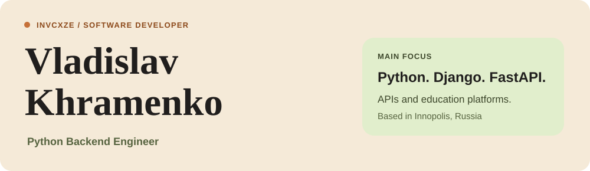
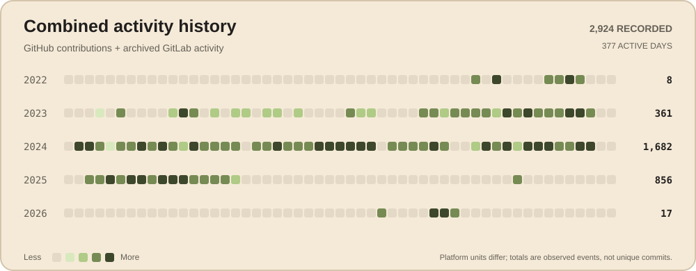
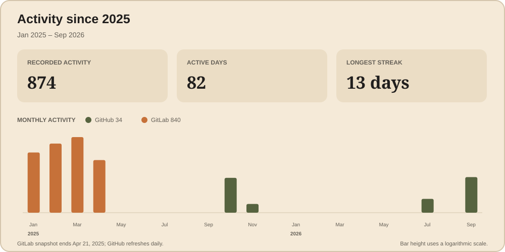

[Explore my code ↗](https://github.com/Invcxze?tab=repositories) · [Telegram](https://t.me/napluseW) · [Email](mailto:vladhromenko@gmail.com)

### Hey, I'm Vlad 👋

I started programming at **13**. Today, I have **3+ years of commercial experience** building Python backends for enterprise HR systems and educational platforms.

I enjoy figuring out how the pieces of a system fit together, turning ideas into working applications, and making existing code easier to live with. My main focus is **Django, DRF, and FastAPI**, with frontend work when a project needs it.

Currently, I'm building a desktop platform with **Rust + Tauri and a FastAPI backend**, studying **Data Analysis and Artificial Intelligence at Innopolis University**, and teaching children and teenagers Python, Godot, and practical AI tools.

### My toolbox

| Area | Tools |
| :--- | :--- |
| Python backend | Python · Django · Django REST Framework · FastAPI · SQLAlchemy |
| Data & background jobs | PostgreSQL · Redis · Celery · Elasticsearch · ELK Stack |
| Real-time & desktop | WebSocket · WebRTC · Rust · Tauri |
| Frontend | React · JavaScript · HTML · CSS |
| Delivery & testing | Docker · Git · GitHub · GitLab · Pytest · Postman |

I've also explored **C, C++, and C#**.

### Things I've built

**Neurodjimmy — Python Backend Developer** 
February 2026 – Present

- Designing an internal desktop platform for an educational club with **Rust + Tauri** and a **FastAPI** backend.
- Building real-time chat and video calls, with **Google OAuth** for authentication and **Google Drive** for file management.
- Teaching programming, game development, and practical AI skills alongside hands-on engineering.

**SEZ Alabuga — Lead Specialist / Python Backend Developer** 
September 2022 – August 2025

- Built enterprise HR and education backends, including a **Student Information System from scratch**.
- Created a file validation and compression service that **reduced storage usage and upload traffic by 93%**.
- Developed an Arduino-integrated business simulator and a Python compiler that generated microcontroller code, **cutting simulation testing time by a factor of five**.

A few more things under the hood

- ETL pipelines and automated analytical reporting.
- A flexible comments system and field-level access control.
- Celery + Redis for background processing and long-running tasks.
- Centralized logging and search with the ELK Stack.
- Legacy refactoring following SOLID principles and real-time communication over WebSocket.

### Engineering with people

Across projects, I've made technical decisions, planned and assigned tasks, and reviewed code. I've mentored **five junior developers** and supervised **24 interns**, tracking progress, reviewing projects, and evaluating results.

I enjoy helping someone go from “I don't get it yet” to “I built this.”

### Education

**Innopolis University** 
Bachelor's degree in Computer Science and Engineering — **expected 2030** 
Specialization: Data Analysis and Artificial Intelligence.

**Yelabuga Polytechnic College · 2026** 
Secondary vocational education in Information Systems and Programming. 
Qualification: Web and Multimedia Application Developer.

### The commit trail

From the first contribution to whatever comes next.

<picture>
  <source media="(prefers-color-scheme: dark)" srcset="./assets/lifetime.dark.svg" />
  
</picture>

### Activity since 2025

This view starts in January 2025, so the final months of my GitLab history remain visible alongside GitHub updates.

<picture>
  <source media="(prefers-color-scheme: dark)" srcset="./assets/contributions.dark.svg" />
  
</picture>

For the statistically curious

 

<picture>
  <source media="(prefers-color-scheme: dark)" srcset="./assets/overview.dark.svg" />
  
</picture>

---

<strong>When the tests pass on the first try.</strong>

